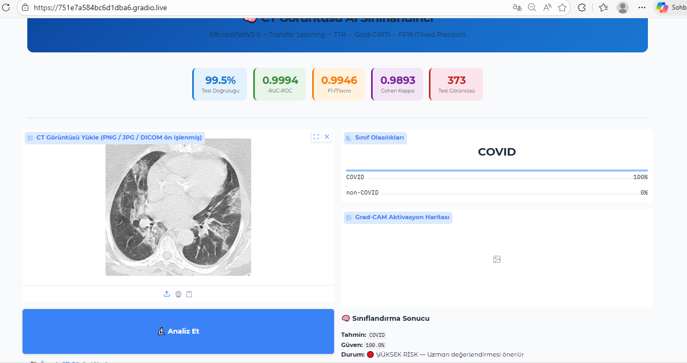
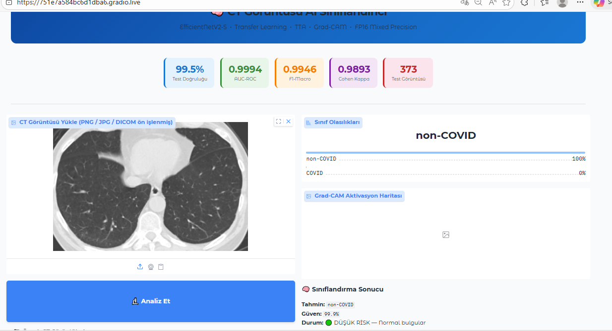
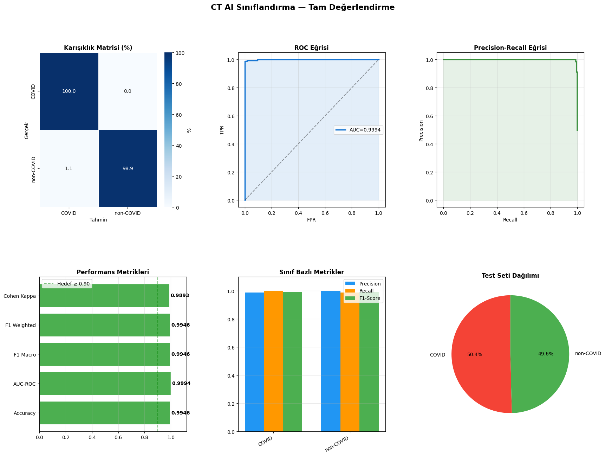

# 🫁 CT-Scan-Classifier-WebApp

<p align="center">
  
  
  
  
</p>

<p align="center">
  
  
  
  
  
</p>

> 🌐 **Upload a chest CT scan → get an instant COVID / non-COVID prediction with confidence score and Grad-CAM heatmap — directly in your browser.**

---

## 🖥️ Web Application

The project ships with a fully interactive **Gradio** web interface. No coding required — just open the app, upload a CT image, and get results in seconds.

<p align="center">
  
  &nbsp;
  
</p>

### ✨ App Features

| Feature | Details |
|---------|---------|
| 📤 **Image Upload** | PNG, JPG, or pre-processed DICOM |
| 🤖 **Instant Prediction** | COVID / non-COVID classification |
| 📊 **Class Probabilities** | Live confidence bar chart |
| 🔥 **Grad-CAM Heatmap** | Visual explanation of where the model looks |
| 🏷️ **Risk Status** | LOW RISK / HIGH RISK label with confidence % |
| 🖼️ **Sample Images** | Built-in example CT images to try instantly |

---

## 📊 Evaluation Results

<p align="center">
  
</p>

| Metric | Value |
|--------|-------|
| **Test Accuracy** | **99.5%** |
| **AUC-ROC** | **0.9994** |
| **F1-Macro** | **0.9946** |
| **F1-Weighted** | **0.9946** |
| **Cohen's Kappa** | **0.9893** |
| Test set size | 373 images |

---

## 🗂️ Dataset

| Property | Details |
|----------|---------|
| **Source** | [SARS-CoV-2 CT-Scan Dataset](https://www.kaggle.com/datasets/plameneduardo/sarscov2-ctscan-dataset) (Kaggle) |
| **License** | CC BY 4.0 |
| **Total images** | 2,482 chest CT scans |
| **Classes** | `COVID` · `non-COVID` |
| **Split** | ~50.4% COVID · ~49.6% non-COVID (balanced) |

---

## 🏗️ Model Architecture

```
Input CT Image (384 × 384 × 3)
        │
        ▼
EfficientNetV2-S (ImageNet pre-trained)
        │
  ┌─────┴─────┐
  GAP        GMP          ← Dual Pooling
  └─────┬─────┘
        │
  Dense → Dropout (0.40)
        │
  Softmax Output
        │
  Prediction + Grad-CAM
```

### Training Strategy

| Phase | Backbone | Learning Rate | Notes |
|-------|----------|--------------|-------|
| **Phase 1 – Warm-up** | Frozen | 1e-3 | Head layers only |
| **Phase 2 – Fine-tuning** | Top 40% unfrozen | 5e-5 | Partial backbone |

### Key Techniques
- ✅ **Transfer Learning** — EfficientNetV2-S pre-trained on ImageNet
- ✅ **Two-Phase Fine-Tuning** — warm-up then partial backbone unfreeze
- ✅ **Class Weighting** — handles class imbalance automatically
- ✅ **Label Smoothing** (0.10) — reduces overconfidence
- ✅ **AdamW** optimizer with weight decay (1e-4)
- ✅ **Test-Time Augmentation (TTA × 5)** — flip LR/UD, brightness, contrast, original
- ✅ **FP16 Mixed Precision** — faster training & inference
- ✅ **Grad-CAM** — visual explanation of model decisions

---

## 🚀 Quick Start

### Run on Google Colab (Recommended)

[](https://colab.research.google.com/github/YOUR_USERNAME/CT-Scan-Classifier-WebApp/blob/main/CT_siniflandirma.ipynb)

1. Open the notebook in Google Colab
2. Mount your Google Drive
3. Upload your `kaggle.json` API key when prompted
4. Run all cells — dataset downloads, model trains, and the **web app launches automatically**
5. Click the Gradio public link to open the app in your browser

### Local Installation

```bash
git clone https://github.com/YOUR_USERNAME/CT-Scan-Classifier-WebApp.git
cd CT-Scan-Classifier-WebApp
pip install -r requirements.txt
```

---

## 📦 Requirements

```
tensorflow>=2.12
gradio
scikit-learn
seaborn
albumentations
opencv-python-headless
fpdf2
numpy
pandas
matplotlib
```

```bash
pip install tensorflow gradio scikit-learn seaborn albumentations opencv-python-headless fpdf2
```

---

## ⚙️ Hyperparameters

| Parameter | Value |
|-----------|-------|
| Image size | 384 × 384 |
| Batch size | 16 |
| Dropout | 0.40 |
| Label smoothing | 0.10 |
| Weight decay | 1e-4 |
| Phase 1 LR | 1e-3 |
| Phase 2 LR | 5e-5 |
| TTA passes | 5 |
| Precision | FP16 Mixed |

---

## 📁 Repository Structure

```
CT-Scan-Classifier-WebApp/
├── CT_siniflandirma.ipynb        # Full training, evaluation & Gradio app
├── README.md
└── assets/
    ├── covid.png                 # Web app screenshot — COVID prediction
    ├── non-covid.png             # Web app screenshot — non-COVID prediction
    └── ct_all_classification.png # Full evaluation dashboard
```

---

## 📄 License

This project is released under the [MIT License](LICENSE).
The dataset is licensed under [CC BY 4.0](https://creativecommons.org/licenses/by/4.0/).

---

## 🙏 Acknowledgements

- Dataset: *Plameneduardo — SARS-CoV-2 CT-Scan Dataset* (Kaggle)
- Model backbone: [EfficientNetV2](https://arxiv.org/abs/2104.00298) (Tan & Le, 2021)
- Visualization: [Grad-CAM](https://arxiv.org/abs/1610.02391) (Selvaraju et al., 2017)
- Web Interface: [Gradio](https://gradio.app)

---

> ⚠️ **Disclaimer:** This tool is intended for research and educational purposes only. It is **not** a certified medical device and should not be used for clinical diagnosis.
